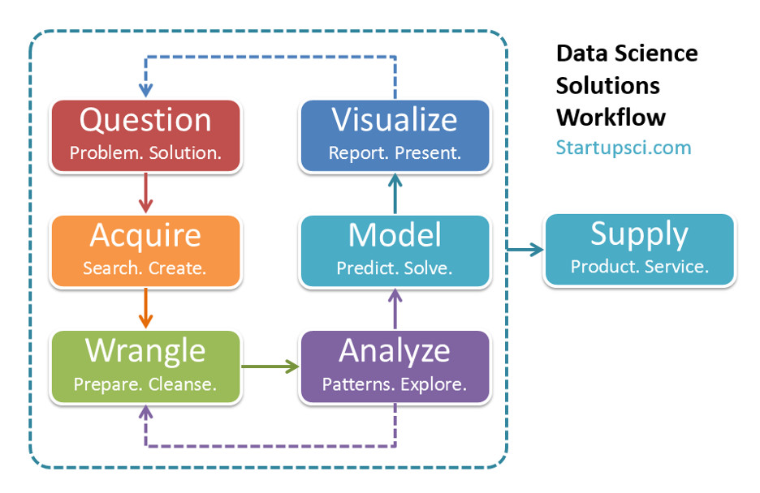
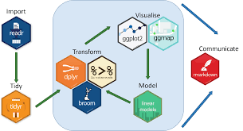

```{r,warning=FALSE,message=FALSE,echo=FALSE}
library(gapminder)
```

# Introduction

This course aims to provide students with an introduction to [data science](https://en.wikipedia.org/wiki/Data_science). Specifically, the course will introduce students to the basic data science workflow following current best practices, and address computational or algorithmic ways to think about data and learning from data.  A heavy emphasis will be placed on [data visualization](https://en.wikipedia.org/wiki/Data_visualization), [exploratory data analysis](https://en.wikipedia.org/wiki/Exploratory_data_analysis), and foundational [statistical modeling](https://en.wikipedia.org/wiki/Statistical_model) and [machine learning](https://en.wikipedia.org/wiki/Machine_learning) principles.

## What is Data Science?

{width=50%}


> Data Science is an emerging new field that (1) is extremely transdisciplinary - bridging between the theoretical, computational, experimental, and biosocial areas; (2) deals with enormous amounts of complex, incongruent, and dynamical data from multiple sources; and (3) aims to develop algorithms, methods, tools, and services capable of ingesting such datasets and generating semiautomated decision support systems. The latter can mine the data for patterns or motifs, predict expected outcomes, suggest clustering or labeling of retrospective or prospective observations, compute data signatures or fingerprints, extract valuable information, and offer evidence-based actionable knowledge. Data science techniques often involve manipulation ([wrangling](https://en.wikipedia.org/wiki/Data_wrangling)), data harmonization and aggregation, exploratory or confirmatory data analyses, [predictive analytics](https://en.wikipedia.org/wiki/Predictive_analytics), [validation](https://en.wikipedia.org/wiki/Statistical_model_validation), and fine-tuning. 

From Chapter 1 of Dinov, ID. (2018) *Data Science and Predictive Analytics: Biomedical and Health Applications using R*, see also the accompanying [website](http://socr.umich.edu/people/dinov/DSPA_Courses.html).

## The Data Science Workflow

{width=75%}

The successful implementation of the data science workflow requires the use of an appropriate technological toolset. In this course an emphasis will be placed using [R](https://www.r-project.org/), [RStudio](https://www.rstudio.com/), and [RMarkdown](https://rmarkdown.rstudio.com/) to implement the data science workflow. 


{width=70%}


A very commonly used alternative to the R-centric tools we will use is the Python-centric tollkit made up of [Python](https://www.python.org/), [Jupyter](https://jupyter.org/), and a host of Python libraries for data science. For those that are interested, the book [Pandas for Everyone](https://www.pearson.com/us/higher-education/program/Chen-Pandas-for-Everyone-Python-Data-Analysis/PGM335102.html) is a great reference that parallels much of what we will do in the course but using Python instead of R.   


## The Data in Data Science

Raw data comes in many different forms, e.g. numerical measurements, text, images, videos, sounds which makes it difficult to precisely answer "what is data?". However, in many tpical applications, the data one works with will have some definite structure or type to it and it is very useful to being to get to know about this.  Let's look at a motivating example from [gapminder](https://www.gapminder.org/).  


## gapminder in R

We can look at an excerpt of the gapminder dataset that is contained in the [gapminder package](https://cran.r-project.org/web/packages/gapminder/README.html). 

The str command in R will provide information about what is contained
```{r}
str(gapminder)
```
 
 
Let's learn more about what the str command is doing
```{r}
?str
```
 
 **Note:** In R, the gapminder data is stored as a data frame (actually a tibble). We will come back and talk in detail about the meaning and significance of this. There are two important points to take note of now though:
 
 1) the data is "rectangular"
 
 2) the different types of data are represented differently

We can view the first few rows of the gapminder dataset 
```{r}
head(gapminder)
```

We can also view the last few rows of the gapminder dataset
```{r}
tail(gapminder)
```

Notice that the columns of a data frame in R have names
```{r}
names(gapminder)
```


The summary() function provides summary statistics for all of the variables is a dataset
```{r}
summary(gapminder)
```

**Question:** What information is given in the output of the call to summary()? 

If you ever want to know what are R command does, you can access the help file for the command with ? as for example in the following
```{r}
?summary
```

If you want to access an individual variable from a dataset (stored as a data frame) in R you can use the $ opertor. For example
```{r}
gapminder$lifeExp
```


This references the lifeExp variable of the gapminder data. 
```{r}
 str(gapminder$lifeExp)
```
Compare this output with what we obtained previously when we called str on gapminder. The gapminder dataset has a tabular structure but the lifeExp variable referenced with gapminder$lifeExp is not a data frame but a numeric vector. 

We can compute the mean (or average) of a numeric vector with the mean command
```{r}
mean(gapminder$lifeExp)
```
Notice that this is one of the values reported in the output to the summary function call on gapminder. 

R has many built-in commands (functions) that can be used to compute values from data. Another example is the table function which provides a type of summary for a **categorical** variable. For example
```{r}
table(gapminder$continent)
```

**Question:** What is the meaning of the output from this code? 
 
R also has a lot of built-in graphing capability. For example,
```{r}
hist(gapminder$lifeExp)
```
This shows a histogram for the values of the lifeExp (continuous) variable. 

```{r}
barplot(table(gapminder$continent))
```
This shows a bar plot of the continent (categorical) variable. 

**Question:** What is the difference between a bar plot and a histogram? 

Soon, we will learn a great deal about data visualization using R. 

We end by noting that R is built around **functions**, these are objects that take some number (possibly zero) of input values and return a value. There are many functions built into base R. In addition, there are very many user-developed packages that contain a variety of functions that extend R far beyond its base capabilities. This is what makes R truly powerful. One very interesting package is the swirl package. This package contains functions that allow you to learn R from within R itself. We will look at an example swirl lesson.  